## MyDrScripts Backend Architecture

This document is the **developer-focused architecture reference** for the MyDrScripts backend.

It is intended for engineers who need to understand:

- how requests move through the codebase
- where business logic lives
- which files own which responsibilities
- how major domains are separated
- where integrations, cron jobs, sockets, and AI features fit in

## 1. System Summary

MyDrScripts backend is a **Sails.js modular monolith** running on **Node.js** with **MySQL + Waterline ORM**.

It acts as the shared backend for multiple clients:

- patient-facing web/app flows
- doctor-facing flows
- admin/back-office workflows

The platform combines several concerns inside one deployable runtime:

- identity and access control
- patient and doctor onboarding
- appointment booking and consultation lifecycle
- wallet, referral, membership, payments, refunds, and payouts
- notifications, chat, sockets, and campaigns
- healthcare integrations such as Medicare, MIMS, and eRx
- AI chat, AI talk, STT, and AI-generated medical notes

## 2. Repository Entry and Bootstrapping

### Entry point

- `app.js`

### Boot sequence

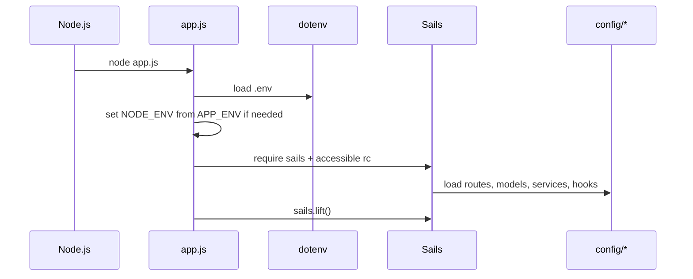

### Important startup behavior

- `.env` is loaded early via `dotenv`
- `process.env.NODE_ENV` is derived from `APP_ENV` if needed
- runtime is lifted through standard Sails boot flow
- all `config/*`, models, services, policies, and controllers are registered through Sails conventions

## 3. Codebase Layout

### Primary directories

| Path | Purpose |
|---|---|
| `app.js` | runtime entry point |
| `api/controllers/` | request/action layer |
| `api/services/` | business logic and integrations |
| `api/models/` | Waterline models |
| `api/policies/` | authorization rules |
| `config/` | routes, env, sockets, cron, security, datastore |
| `assets/` | static assets and templates |
| `views/` | minimal Sails view layer |

### High-level code organization

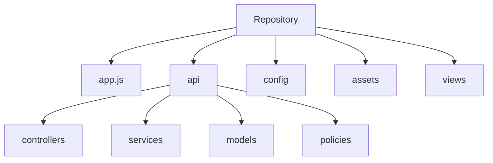

## 4. Request Processing Architecture

### Normal request path

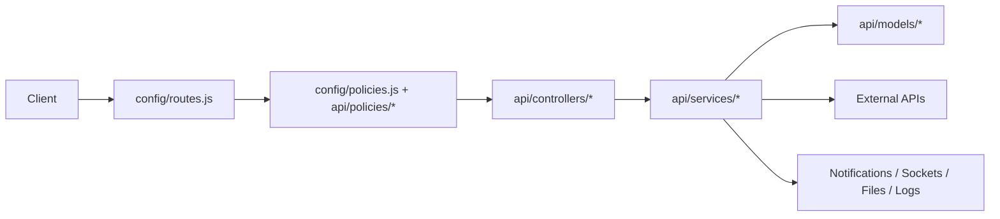

### Core route file

- `config/routes.js`

This file is the central API map. It contains a large route surface and points to both:

- legacy controller actions
- action-based controller files grouped by feature

### Observed route-heavy areas

| Route group | Approx count |
|---|---:|
| `admin` | 64 |
| `doctor` | 43 |
| `patient` | 23 |
| `user` | 22 |
| `communication` | 19 |
| `mims` | 16 |
| `erx` | 14 |
| `agora` | 8 |
| `health-metrics` | 8 |
| `booking` | 6 |
| `ai-chat` | 5 |

This is a strong indicator that the backend is broad and operationally dense rather than a narrow API service.

## 5. Controller Architecture

### Controller styles in the repo

The application uses **two parallel controller patterns**.

#### A. Legacy root controllers

Examples:

- `api/controllers/UserController.js`
- `api/controllers/DoctorController.js`
- `api/controllers/WebhookController.js`
- `api/controllers/AgoraController.js`
- `api/controllers/AgoraSttController.js`
- `api/controllers/AiChatController.js`
- `api/controllers/AiTalkController.js`
- `api/controllers/MedicalNotesController.js`
- `api/controllers/MedicareController.js`
- `api/controllers/MimsController.js`
- `api/controllers/ErxController.js`

#### B. Action-based feature folders

Examples:

- `api/controllers/users/*`
- `api/controllers/patients/*`
- `api/controllers/doctors/*`
- `api/controllers/admin/*`
- `api/controllers/communication/*`
- `api/controllers/booking/*`
- `api/controllers/socket/*`
- `api/controllers/chat/*`

### Practical interpretation

- older platform logic tends to sit in larger root controllers
- newer and more maintainable flows tend to be split one-action-per-file
- engineers should expect mixed conventions when navigating features

### Controller inventory snapshot

- controller files: **323**
- root controller files: **14**
- action controller files: **309**

## 6. Policy and Authorization Architecture

### Core files

- `config/policies.js`
- `api/policies/isAuthenticated.js`
- `api/policies/isDoctor.js`
- `api/policies/isPatient.js`
- `api/policies/isAdmin.js`
- `api/policies/checkModulePermission.js`

### Auth flow

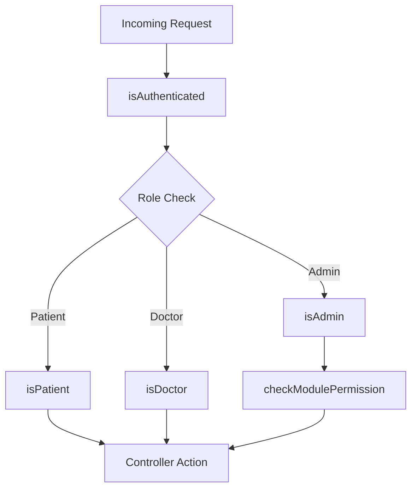

### JWT handling

Primary auth helper:

- `api/services/JwtService.js`

Observed behavior from the code scan:

- JWTs are central to request authentication
- role-aware policies build on top of auth verification
- admin access can be narrowed by module/action permission checks
- some flows can attach refreshed JWTs to response headers

## 7. Service Layer Architecture

The **service layer is the real core of the application**. Controllers mainly orchestrate requests; services do the business work.

### Key service files

- `api/services/UserService.js`
- `api/services/BookingService.js`
- `api/services/DoctorService.js`
- `api/services/StripeService.js`
- `api/services/NotificationService.js`
- `api/services/SocketService.js`
- `api/services/FileService.js`
- `api/services/MailService.js`
- `api/services/SmsService.js`
- `api/services/CommunicationService.js`
- `api/services/MembershipService.js`
- `api/services/WalletService.js`
- `api/services/ReferralService.js`
- `api/services/OpenAIService.js`
- `api/services/MedicalScribeService.js`
- `api/services/AiTalkService.js`
- `api/services/FirebaseService.js`
- `api/services/MedicareService.js`
- `api/services/MimsService.js`
- `api/services/ErxService.js`
- `api/services/CronService.js`
- `api/services/LogService.js`

### Service dependency view

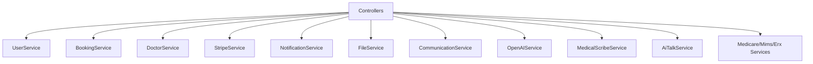

### Service responsibilities by concern

| Concern | Primary files |
|---|---|
| auth/session helpers | `JwtService.js`, `UserService.js` |
| booking lifecycle | `BookingService.js` |
| doctor workflow | `DoctorService.js` |
| payments/subscriptions | `StripeService.js`, `MembershipService.js`, `WalletService.js`, `ReferralService.js` |
| notifications | `NotificationService.js`, `FirebaseService.js`, `MailService.js`, `SmsService.js`, `SocketService.js` |
| storage | `FileService.js` |
| communication campaigns | `CommunicationService.js` |
| AI | `OpenAIService.js`, `MedicalScribeService.js`, `AiTalkService.js` |
| healthcare integrations | `MedicareService.js`, `MimsService.js`, `ErxService.js` |
| jobs and observability | `CronService.js`, `LogService.js` |

## 8. Model and Persistence Architecture

### Persistence stack

- datastore config: `config/datastores.js`
- ORM: Waterline
- primary DB: MySQL

### Representative models

- `api/models/Users.js`
- `api/models/Patient_Booking.js`
- `api/models/Doctor_Details.js`
- `api/models/Settings.js`
- `api/models/Group_Sockets.js`
- `api/models/Ai_Chat_Logs.js`
- `api/models/Stt_Sessions.js`
- `api/models/Stt_Transcripts.js`

### Data ownership structure

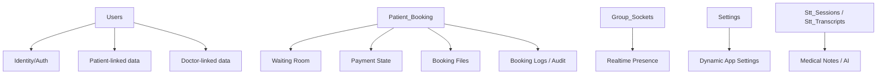

### Scale snapshot

- model files: **111**

### Data design notes

- schema is largely normalized by domain table
- some business objects store flexible metadata in JSON-style fields
- `Settings` is used as a DB-backed configuration store via `meta_key` / `meta_value`
- many log and audit entities are persisted in DB for traceability

## 9. Configuration Architecture

### Important config files

- `config/routes.js`
- `config/policies.js`
- `config/datastores.js`
- `config/http.js`
- `config/sockets.js`
- `config/session.js`
- `config/security.js`
- `config/cron.js`
- `config/custom.js`
- `config/globals.js`
- `config/bootstrap.js`
- `config/env/development.js`
- `config/env/staging.js`
- `config/env/production.js`

### Config source model

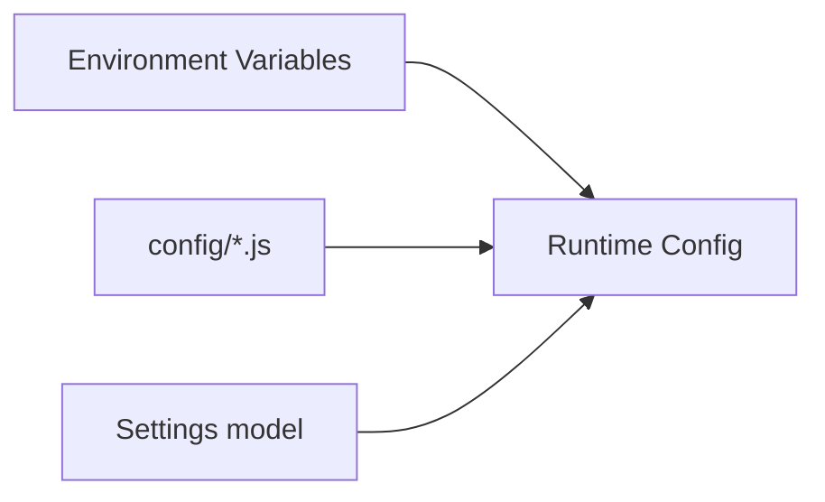

### Notable config patterns

- environment-driven secrets and external credentials
- static Sails config for framework behavior
- DB-backed settings for mutable platform options
- `config/http.js` includes important middleware behavior such as webhook/raw-body handling
- `config/cron.js` drives scheduled workflow execution

## 10. Domain Architecture

### Domain overview

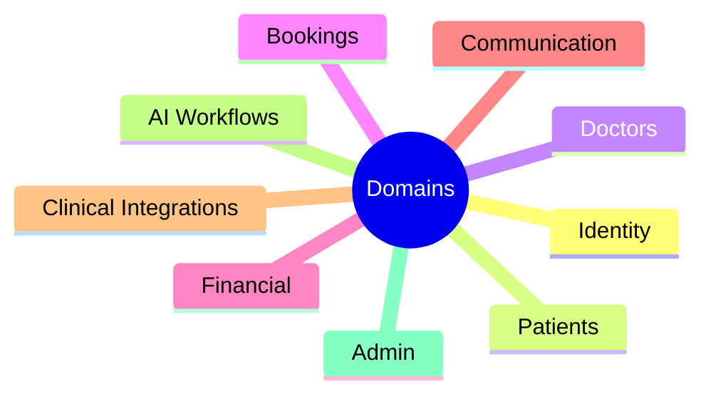

### Identity domain

Primary files:

- `api/services/JwtService.js`
- `api/services/UserService.js`
- `api/policies/isAuthenticated.js`

Responsibilities:

- login/session validation
- OTP and verification support
- password/reset/account flows
- role-aware access checks

### Patient domain

Primary code areas:

- `api/controllers/patients/*`
- `api/controllers/users/*`
- patient-related models and booking models

Responsibilities:

- onboarding
- profile management
- family/member flows
- health metrics and refill flows
- patient participation in bookings

### Doctor domain

Primary code areas:

- `api/controllers/doctors/*`
- `api/controllers/DoctorController.js`
- `api/models/Doctor_Details.js` and related doctor entities

Responsibilities:

- onboarding and verification
- qualifications/documents
- slots/availability
- service mapping
- booking participation and earnings/payout flows

### Booking domain

Primary files:

- `api/services/BookingService.js`
- `api/models/Patient_Booking.js`
- `api/controllers/booking/*`

Responsibilities:

- create/update bookings
- pricing and discount application
- payment state linkage
- waiting room lifecycle
- cancellation/reschedule/follow-up logic

### Financial domain

Primary files:

- `api/services/StripeService.js`
- `api/services/MembershipService.js`
- `api/services/WalletService.js`
- `api/services/ReferralService.js`
- `api/controllers/WebhookController.js`

Responsibilities:

- Stripe checkout and webhook reconciliation
- subscriptions/memberships
- wallet transactions and discounts
- referral incentives
- payouts, refunds, and related adjustments

### Communication domain

Primary files:

- `api/services/NotificationService.js`
- `api/services/CommunicationService.js`
- `api/services/MailService.js`
- `api/services/SmsService.js`
- `api/services/FirebaseService.js`
- `api/services/SocketService.js`

Responsibilities:

- in-app notifications
- push notifications
- transactional email/SMS
- group communication
- template/campaign processing

### Clinical integration domain

Primary files:

- `api/controllers/MedicareController.js`
- `api/controllers/MimsController.js`
- `api/controllers/ErxController.js`
- `api/services/MedicareService.js`
- `api/services/MimsService.js`
- `api/services/ErxService.js`

Responsibilities:

- Medicare and PRODA related flows
- medicine/provider lookup and MIMS access
- eRx prescription-related workflows

### AI domain

Primary files:

- `api/controllers/AiChatController.js`
- `api/controllers/AiTalkController.js`
- `api/controllers/AgoraSttController.js`
- `api/controllers/MedicalNotesController.js`
- `api/services/OpenAIService.js`
- `api/services/AiTalkService.js`
- `api/services/MedicalScribeService.js`

Responsibilities:

- AI-assisted chat/service discovery
- voice AI sessions
- speech-to-text session handling
- transcript-to-medical-note generation

## 11. Realtime Architecture

### Core realtime files

- `config/sockets.js`
- `api/controllers/socket/connect.js`
- `api/services/SocketService.js`
- `api/models/Group_Sockets.js`
- `api/controllers/chat/*`

### Realtime flow

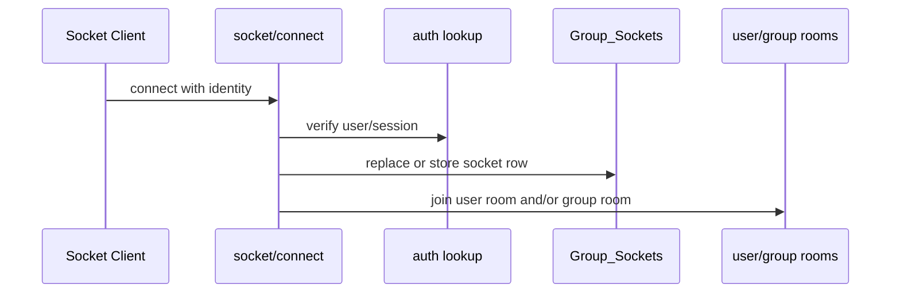

### Realtime uses

- user-specific notification delivery
- chat messaging
- room/group communication
- presence-like socket tracking

## 12. Background Job Architecture

### Core job files

- `config/cron.js`
- `api/services/CronService.js`

### Execution model

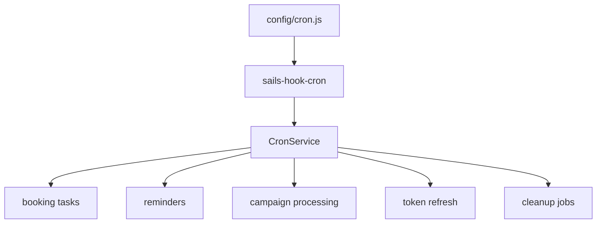

### Typical responsibilities

- reminder dispatch
- booking follow-ups and unpaid-state handling
- campaign execution
- medication refill reminders
- token refresh for external integrations
- invoice, referral, wallet, and stale-state maintenance

## 13. Notification and Messaging Architecture

### Channel fan-out pattern

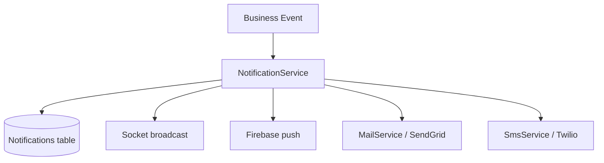

### Key files

- `api/services/NotificationService.js`
- `api/services/FirebaseService.js`
- `api/services/MailService.js`
- `api/services/SmsService.js`

## 14. File and Storage Architecture

### Storage file

- `api/services/FileService.js`

### Storage usage

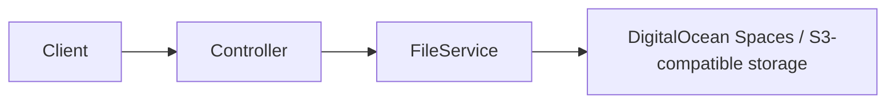

Typical stored artifacts include:

- user and doctor documents
- booking attachments
- generated assets/PDFs
- AI/STT-related output files where applicable

## 15. Logging and Observability

### Core file

- `api/services/LogService.js`

### Logging design

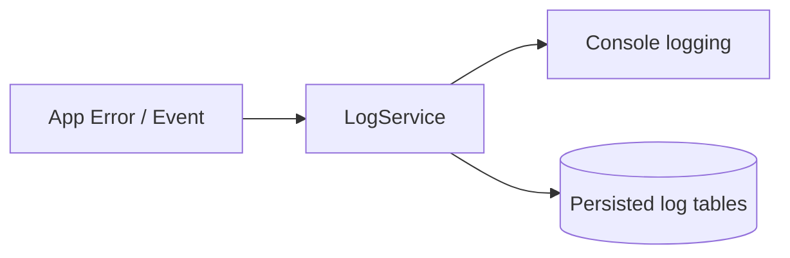

Observed log categories in the codebase include:

- common logs
- error logs
- booking audit logs
- Medicare/HI-related logs
- eRx audit logs

## 16. Scale and Maintenance Notes

### Current size snapshot

| Artifact | Count |
|---|---:|
| controllers | 323 |
| models | 111 |
| services | 36 |
| policies | 6 |
| API routes | ~411 |

### Maintenance implications

- navigation is easiest when starting from `config/routes.js`
- many features span controller + service + multiple models + integrations
- some domains are mature enough to have both sync request paths and cron/webhook paths
- service files often contain the most important implementation details

## 17. Recommended Navigation Strategy for Developers

When debugging or extending a feature, use this order:

1. **Find the route** in `config/routes.js`
2. **Find attached policies** in `config/policies.js`
3. **Open the controller/action** handling the route
4. **Follow service calls** into `api/services/*`
5. **Inspect touched models** in `api/models/*`
6. **Check side systems** if needed:
   - webhooks
   - cron jobs
   - sockets
   - email/SMS/push
   - external integrations

## 18. Final Developer Summary

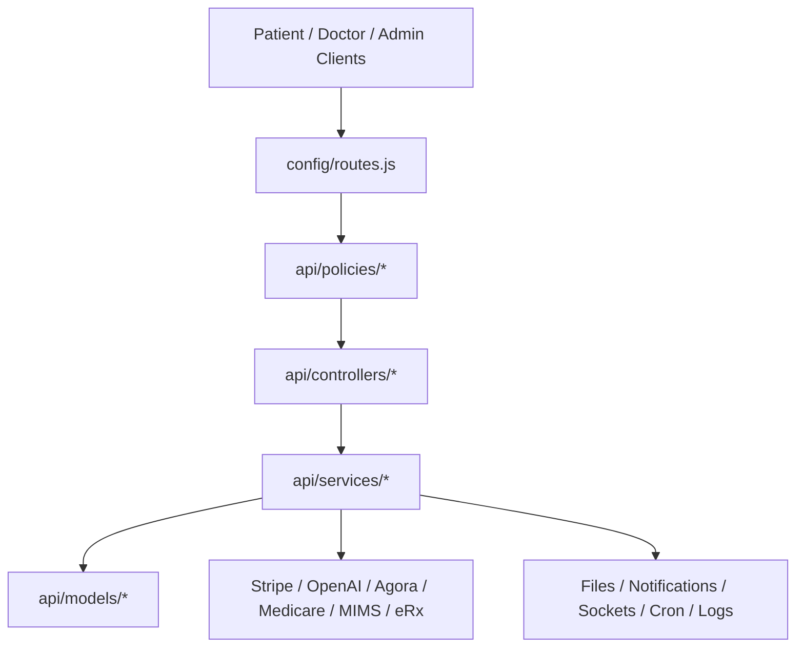

**In practice: the backend is a feature-rich Sails monolith where the service layer is the center of business behavior, and most non-trivial features span controllers, services, models, notifications, and one or more external integrations.**