## MyDrScripts Backend Data Flow

This document focuses on **how data moves through the system** rather than the static structure of the repository.

It is intended to help developers understand:

- request-to-response flow
- side-effect fan-out
- booking/payment lifecycle paths
- notification and realtime propagation
- cron and webhook driven flows
- AI/STT/medical note movement

## 1. Base Request Flow

### End-to-end request path

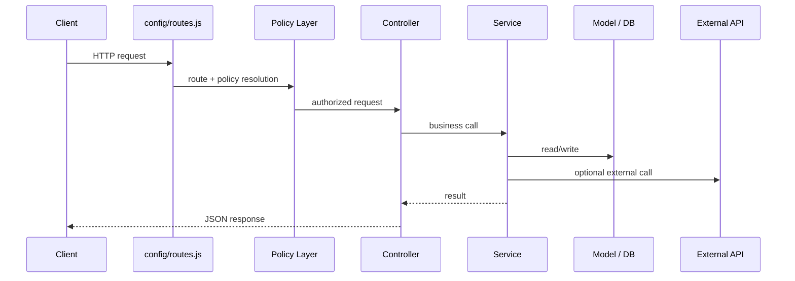

### Main files in the path

- `config/routes.js`
- `config/policies.js`
- `api/policies/*`
- `api/controllers/*`
- `api/services/*`
- `api/models/*`

## 2. Auth Data Flow

### Authentication and access flow

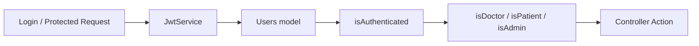

### Notes

- identity centers around `Users`
- JWT validation gates most protected flows
- admin flows may continue into `checkModulePermission`
- user context then drives downstream domain access

## 3. Booking Creation Flow

### Booking request lifecycle

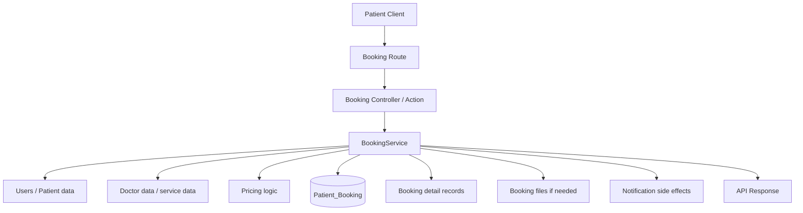

### Main code touchpoints

- `api/services/BookingService.js`
- `api/models/Patient_Booking.js`
- `api/controllers/booking/*`

### Data written during booking-related flows

- booking row
- optional booking detail rows
- audit/log rows
- file attachments
- downstream notification records

## 4. Booking State Transition Flow

### Runtime + background transitions

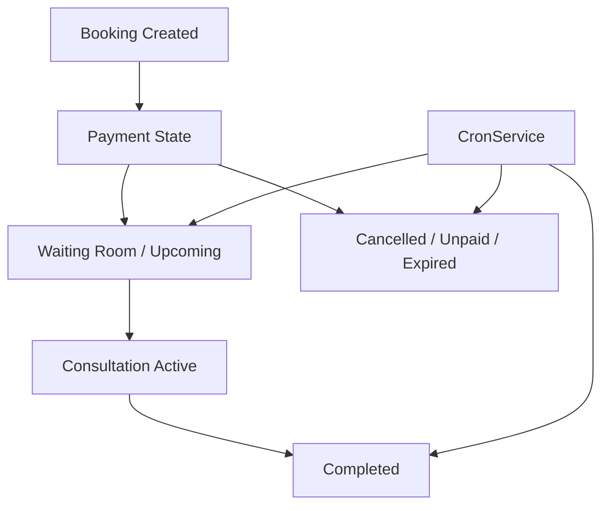

### Why this matters

Booking state is not managed only by synchronous APIs.

It can also be affected by:

- webhooks
- cron jobs
- payment success/failure callbacks
- doctor/patient actions

## 5. Payment and Stripe Data Flow

### Payment lifecycle

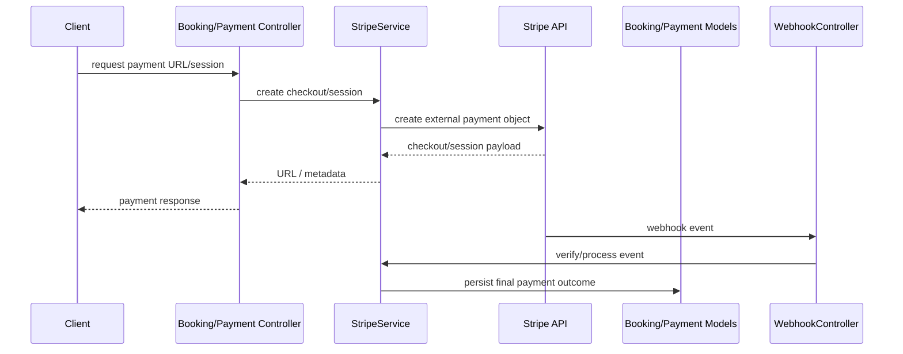

### Main files

- `api/services/StripeService.js`
- `api/controllers/WebhookController.js`
- booking/payment controllers and models
- `config/http.js` for webhook raw-body handling

### Side effects after successful payment

- booking payment state update
- wallet/membership/referral adjustments
- notifications
- downstream consultation readiness

## 6. Wallet / Referral / Membership Flow

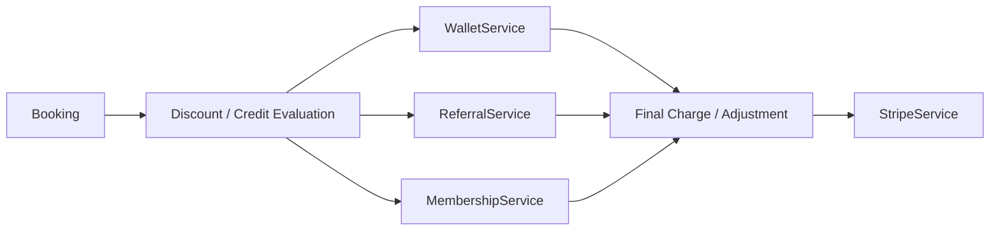

### Main idea

Final booking cost is not always just service price.

It may depend on:

- wallet credit
- referral incentive state
- membership discount logic
- Stripe success/failure outcome

## 7. Notification Flow

### Event fan-out path

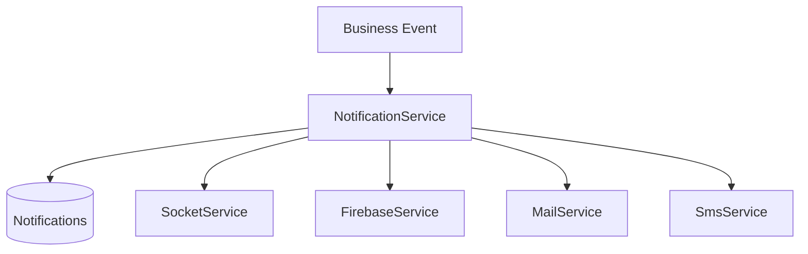

### Event sources commonly feeding notifications

- booking creation/update/cancel
- payment state changes
- reminders
- communication campaigns
- admin or doctor actions

## 8. Realtime Socket Flow

### Connection flow

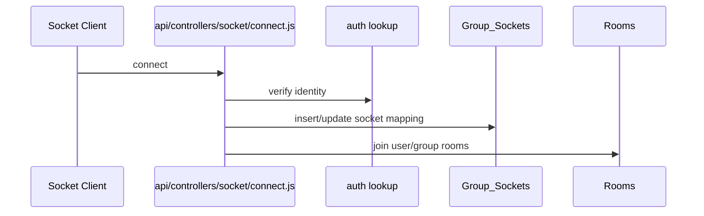

### Message / event delivery flow

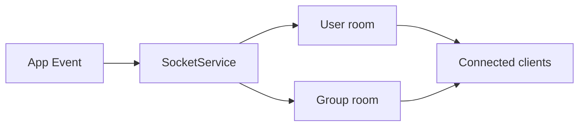

## 9. Communication Campaign Flow

### Campaign processing path

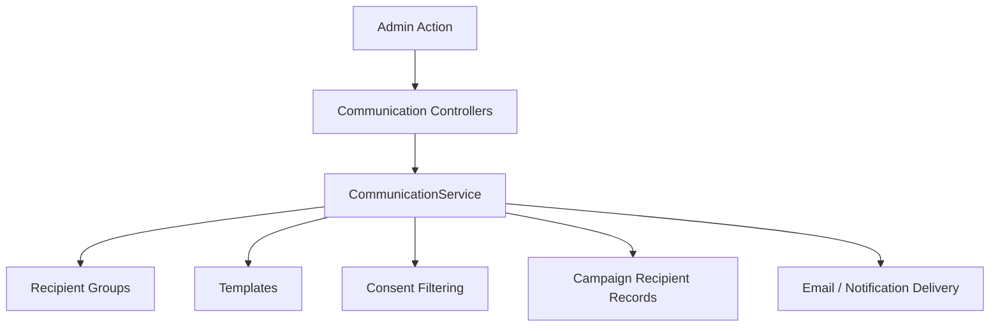

### Async execution note

Campaigns are not only request-driven.

They can also be picked up and processed by cron jobs for delayed or batched delivery.

## 10. File Upload and Retrieval Flow

### Storage path

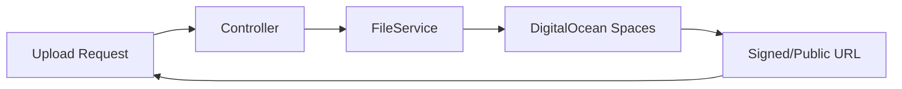

### Typical file categories

- doctor documents
- patient documents
- booking attachments
- generated artifacts or PDFs
- AI/STT assets where applicable

## 11. AI Chat Flow

### AI service-discovery style flow

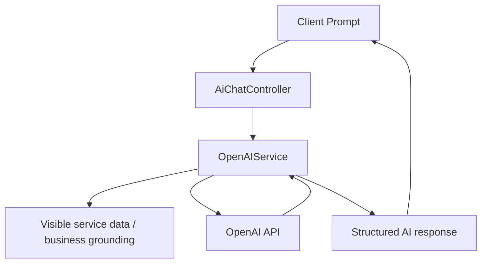

### Main idea

The AI layer is not just generic prompting. It appears to use live service/domain data to ground responses for the product.

## 12. AI Talk / Voice Flow

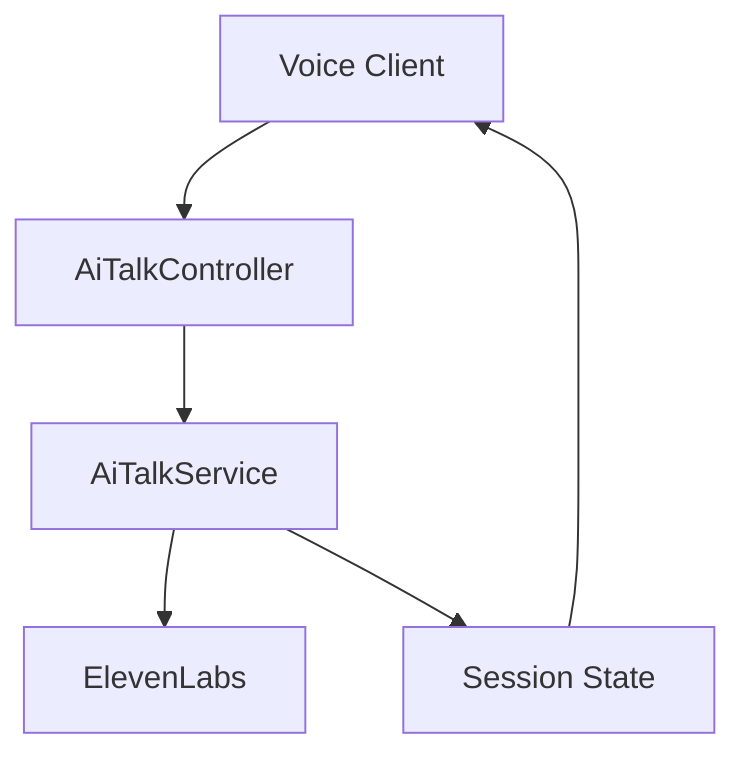

### Purpose

- create/manipulate voice AI sessions
- return signed/session-aware payloads to frontend
- mediate tool execution through controlled service logic

## 13. STT and Medical Notes Flow

### Transcript to notes path

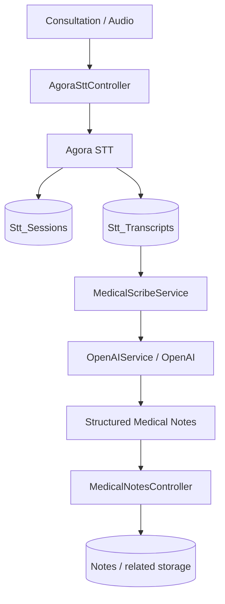

### Main files

- `api/controllers/AgoraSttController.js`
- `api/services/MedicalScribeService.js`
- `api/controllers/MedicalNotesController.js`
- `api/models/Stt_Sessions.js`
- `api/models/Stt_Transcripts.js`

## 14. Healthcare Integration Flow

### External clinical integration pattern

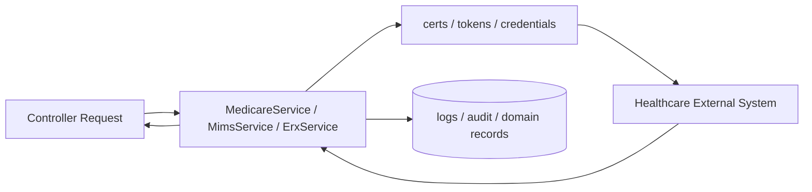

### Main pattern seen in codebase

- controller receives request
- service prepares auth or XML/token payloads
- outbound integration is called
- result is logged and/or persisted
- domain entity is updated or response returned

## 15. Cron-Driven Flow

### Scheduled execution path

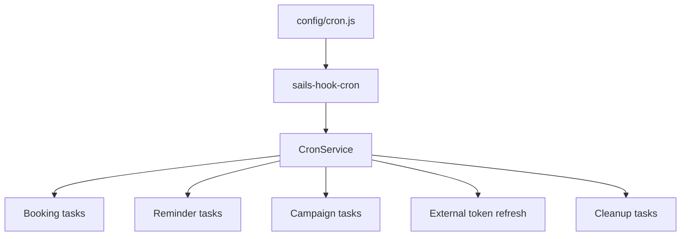

### Important implication

Some system state changes happen **without an incoming API request**.

When debugging a record mutation, check:

- user action
- webhook action
- cron action

## 16. Logging Flow

### Error/event persistence path

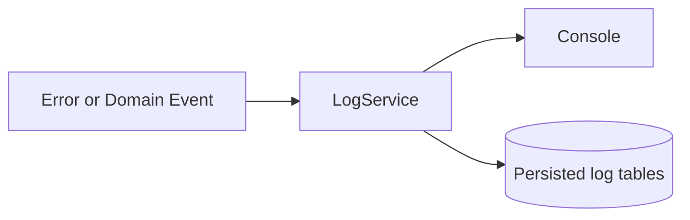

### Debugging implication

Operational context may exist in:

- runtime logs
- database log tables
- booking audit records
- integration-specific logs

## 17. Recommended Debugging Flow

When tracing unexpected behavior, use this order:

1. find the route in `config/routes.js`
2. confirm policies in `config/policies.js`
3. open controller/action
4. follow service calls
5. inspect touched models
6. check for:
   - webhook involvement
   - cron involvement
   - socket/notification side effects
   - external integration responses
   - persisted logs

## 18. Final Flow Summary

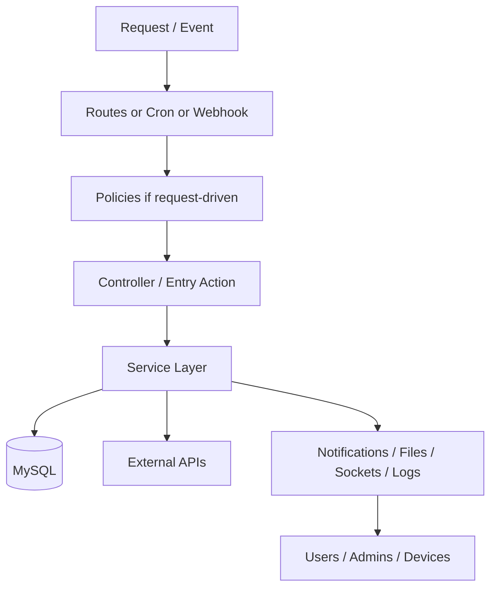

**The most important architectural fact about data flow in this system is that business state can change through three paths: request handlers, webhooks, and cron jobs.**