## MyDrScripts Backend Integrations

This document summarizes the major external integrations used by the backend, where they are connected in code, and what role they play in the platform.

## 1. Integration Topology

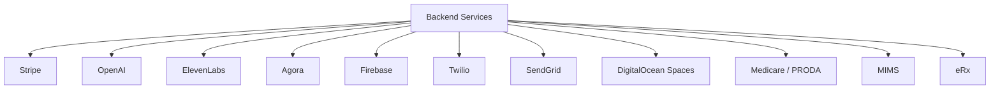

## 2. Configuration Sources for Integrations

### Primary config files

- `config/custom.js`
- `config/globals.js`
- `config/http.js`
- `config/env/development.js`
- `config/env/staging.js`
- `config/env/production.js`

### Config pattern

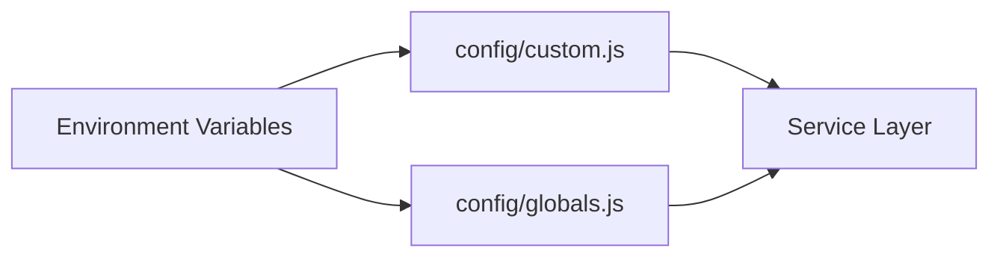

### Observed integration-related config themes

- Stripe keys and webhook-related settings
- OpenAI credentials
- Firebase and push settings
- Twilio credentials
- SendGrid API key
- Agora credentials
- ElevenLabs configuration
- storage credentials for S3-compatible object storage
- healthcare integration auth details and certificate paths

## 3. Stripe

### Main files

- `api/services/StripeService.js`
- `api/controllers/WebhookController.js`
- booking/payment-related controllers
- `config/http.js`

### Responsibilities

- create checkout/session flows
- manage subscriptions/memberships
- connected account and payout support
- refund handling
- webhook verification and reconciliation

### Integration flow

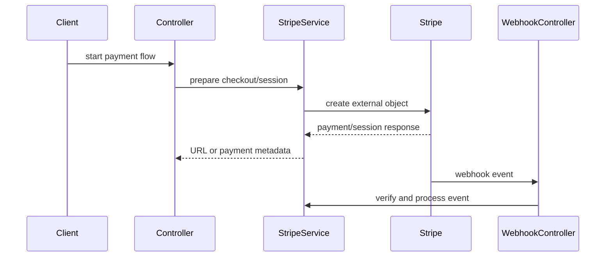

### Engineering notes

- webhook raw-body handling is important for signature verification
- Stripe likely affects booking status, memberships, wallet/referral logic, and payouts

## 4. OpenAI

### Main files

- `api/services/OpenAIService.js`
- `api/controllers/AiChatController.js`
- `api/services/MedicalScribeService.js`
- `api/controllers/MedicalNotesController.js`

### Responsibilities

- AI chat / product-guided conversation
- transcript-to-note generation
- structured AI output for clinical support features

### Integration flow

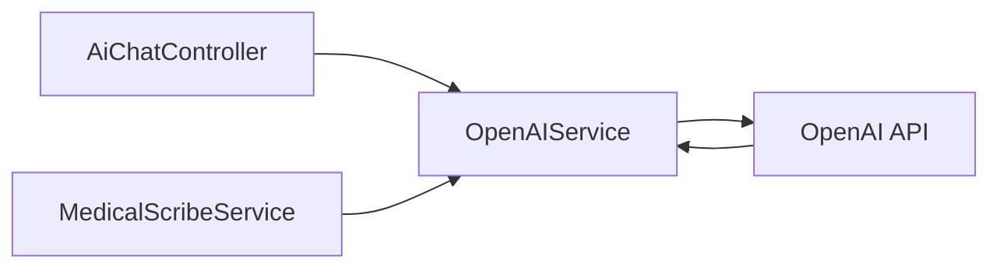

### Engineering notes

- AI use is not isolated to one feature; it spans user-facing chat and clinician-facing note generation
- when debugging AI output, inspect both controller intent and service prompt/domain grounding logic

## 5. ElevenLabs

### Main files

- `api/services/AiTalkService.js`
- `api/controllers/AiTalkController.js`

### Responsibilities

- voice AI session support
- signed/session-aware voice workflow responses

### Flow

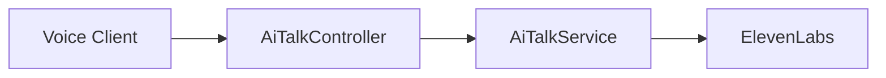

## 6. Agora

### Main files

- `api/controllers/AgoraController.js`
- `api/controllers/AgoraSttController.js`
- Agora-related services/controllers for tokens or STT

### Responsibilities

- realtime consultation-related support
- token and channel/session support
- speech-to-text session orchestration

### Flow

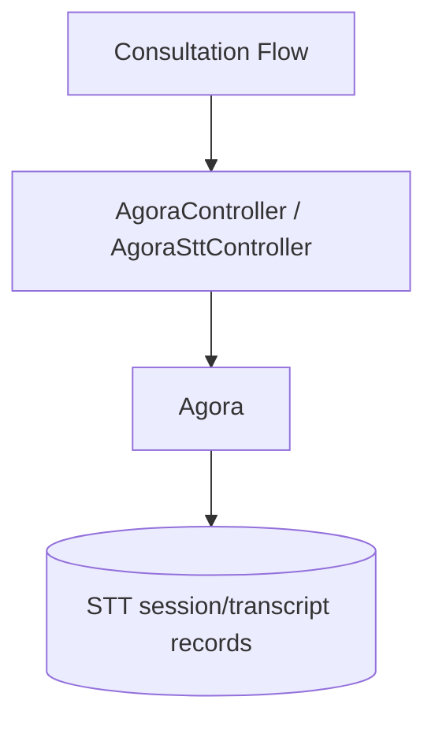

## 7. Firebase

### Main files

- `api/services/FirebaseService.js`
- `api/services/NotificationService.js`

### Responsibilities

- push notification delivery

### Implementation note

`FirebaseService.js` initializes `firebase-admin` using `firebase-admin.json`, so local/service-account credentials are part of the runtime requirement.

### Flow

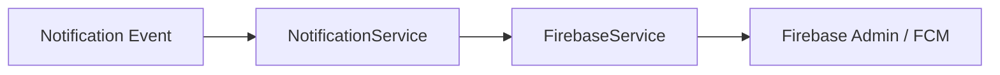

## 8. Twilio

### Main files

- `api/services/SmsService.js`

### Responsibilities

- OTP delivery
- SMS notifications or verification messaging

### Flow

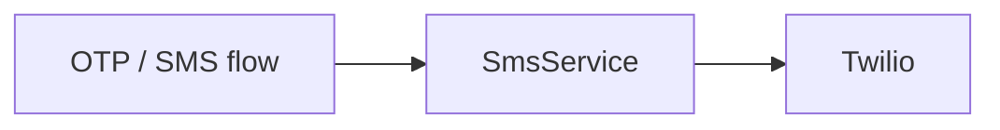

### Engineering notes

- SMS behavior is feature-flag sensitive via global settings
- `SmsService` supports OTP/body generation patterns

## 9. SendGrid

### Main files

- `api/services/MailService.js`

### Responsibilities

- transactional email
- template-driven emails
- campaign or appointment-related email delivery

### Flow

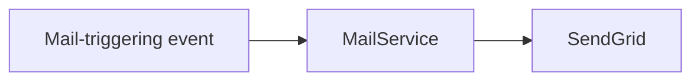

### Engineering notes

- email sending is feature-flag sensitive
- email templates are resolved in service code before dispatch

## 10. DigitalOcean Spaces / S3-Compatible Storage

### Main files

- `api/services/FileService.js`

### Responsibilities

- upload/store files
- generate URLs
- support documents and generated assets

### Flow

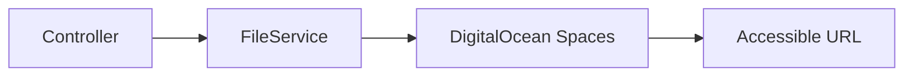

### Likely payload categories

- doctor documents
- patient documents
- booking attachments
- generated PDFs/assets
- AI/STT-related files where needed

## 11. Medicare / PRODA

### Main files

- `api/controllers/MedicareController.js`
- `api/services/MedicareService.js`

### Responsibilities

- healthcare system integration
- token/auth generation and exchange
- certificate/key-driven workflows
- provider/patient related external operations

### Flow

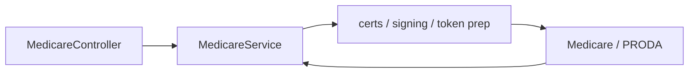

### Engineering notes

- these flows are likely sensitive to environment, keys, and filesystem certificate availability
- integration logs are important when debugging failures

## 12. MIMS

### Main files

- `api/controllers/MimsController.js`
- `api/services/MimsService.js`

### Responsibilities

- medicine-related external access
- token/session lifecycle for MIMS-backed features

### Flow

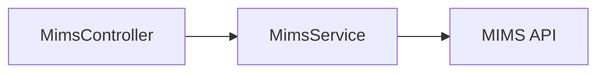

## 13. eRx

### Main files

- `api/controllers/ErxController.js`
- `api/services/ErxService.js`

### Responsibilities

- ePrescription-related workflows
- XML/certificate or signed integration patterns
- audit logging of prescription-related exchange steps

### Flow

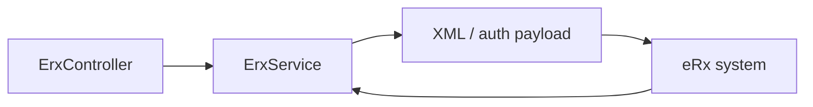

## 14. Cross-Integration Dependencies

### Example cross-system flow

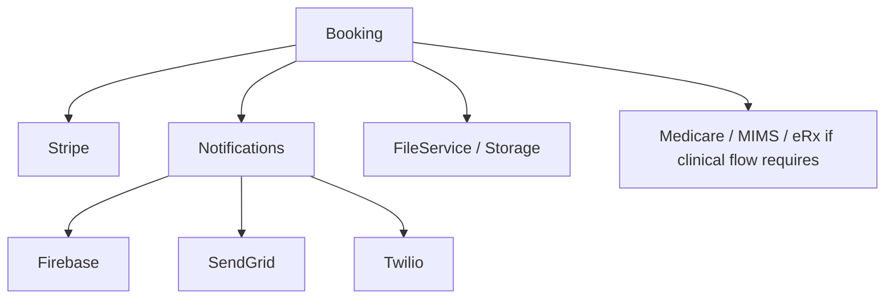

### Important insight

Most integrations are not isolated. A single business event may involve several systems.

Example:

- patient books appointment
- payment session is created via Stripe
- booking record is stored in MySQL
- notification is emitted through push/email/SMS/socket
- related files or certificates may be generated/stored

## 15. Failure and Debugging Checklist by Integration

### Stripe

- confirm request path and service input
- inspect webhook event processing
- inspect booking/payment rows after webhook
- verify raw-body/webhook config

### OpenAI / AI

- inspect controller payload
- inspect prompt/domain grounding logic in `OpenAIService.js`
- inspect transcript input if notes are involved

### Agora / STT

- inspect session start/stop path
- inspect transcript/session models
- verify downstream note-generation trigger path

### Firebase

- inspect token/device records
- verify `firebase-admin.json` availability
- inspect notification fan-out path

### Twilio / SendGrid

- verify feature flags
- verify resolved destination contact fields
- inspect service-level logging and return payload

### Medicare / MIMS / eRx

- verify environment-specific credentials/certs
- inspect integration logs/audit records
- isolate whether failure is auth, payload, or external response related

## 16. Final Integration Summary

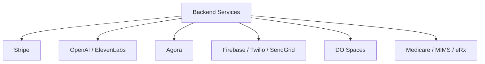

**The integration layer is one of the most important architectural characteristics of this backend: many core business flows are orchestration flows across internal services, MySQL state, and multiple external systems.**